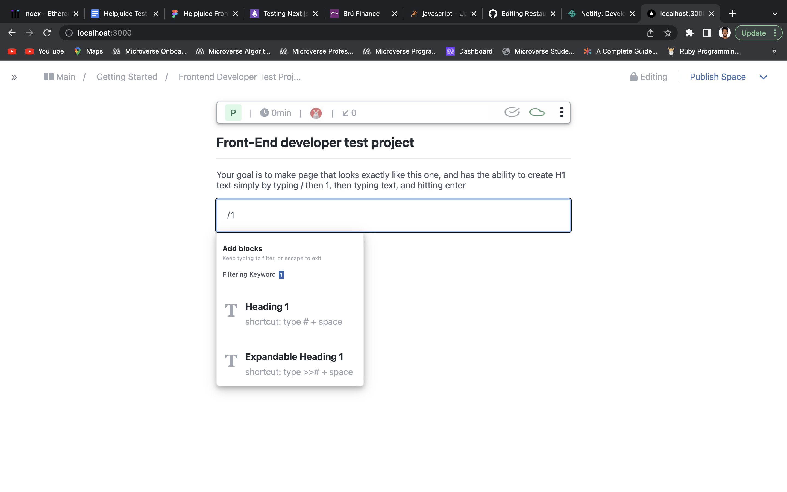

# Frontend Test Project

> Is a project that changes any text to Heading 1. 



## Deployed to

[Link](https://amazing-kleicha-18958a.netlify.app/)

## Built With

- JavaScript
- Nextjs
- CSS module
- HTML5
- Jest
- Font awesome
- localstorage

## Install

```
$ npm install

```

## Getting Started

## To get local copy up and running follow these simple example steps

```
- git clone git@github.com:Addis-Belete/HelpJuice_Project.git
- run npm install
- run npm run dev

```

## Instruction 

```
- To convert to Heading 1 please type "/1" first. Then type any text. 
```

## Test

```
- npm run test 
```

👤 **Addis Belete**

- GitHub: [@Addis0943](https://github.com/Addis0943)
- Twitter: [@Addis32018084](https://twitter.com/Addis32018084)
- LinkedIn: [LinkedIn](https://www.linkedin.com/in/addis-belete-134b98191/)

## 🤝 Contributing

Contributions, issues, and feature requests are welcome!

Feel free to check the [issues page](../../issues/).

## Show your support

Give a ⭐️ if you like this project!

## Acknowledgments

- Hat tip to anyone whose code was used
- Inspiration
- etc

## 📝 License

This project is [MIT](./MIT.md) licensed.

```

```